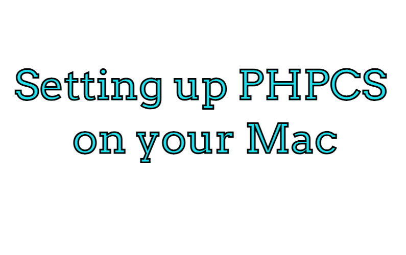
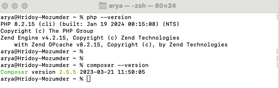
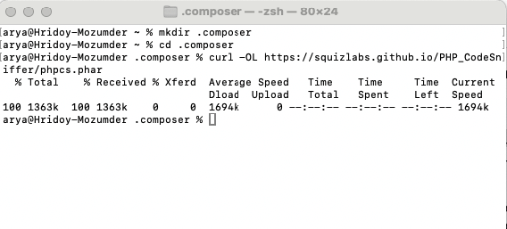
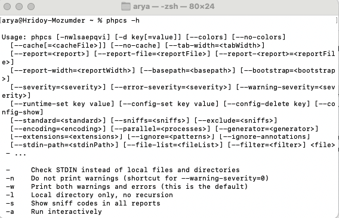
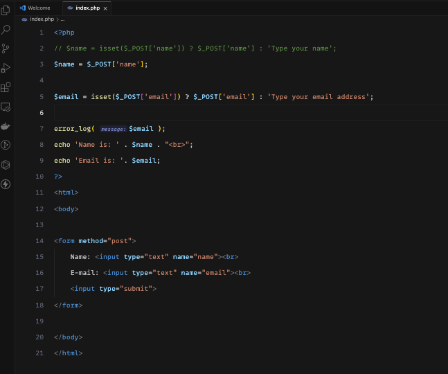
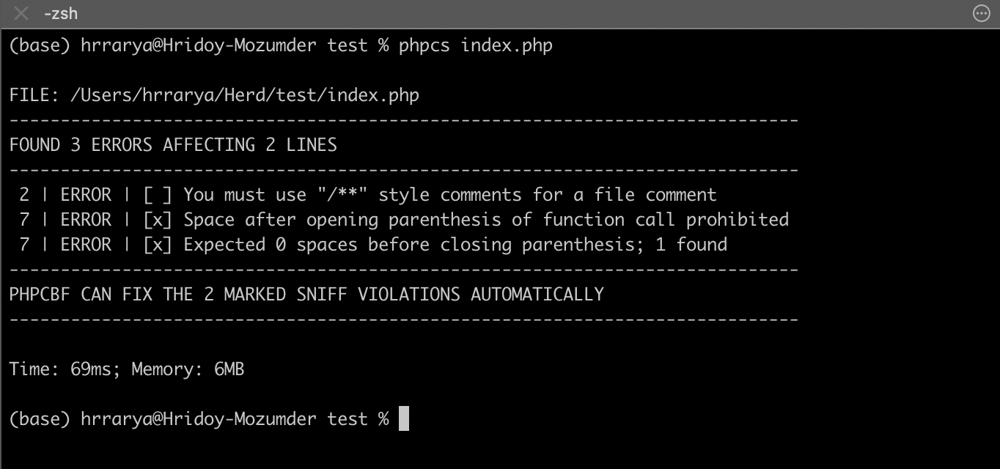

<!--  -->



# Setting up PHPCS on your Mac

[PHPCS](https://github.com/squizlabs/PHP_CodeSniffer) is an open-source command-line tool designed to identify code style violations based on defined coding standards. Additionally, it offers automatic fixes for rules that can be corrected automatically.

## Install PHP

For Mac users, installing PHP and Composer is straightforward using [Laravel Herd](https://herd.laravel.com/). Visit the Laravel Herd website, download the package, and follow the simple instructions.

After completing the installation, ensure that PHP and Composer are installed correctly by running the following commands in your terminal:

```sh
php --version
```

```sh
composer --version
```

If both are installed correctly, the terminal will display the respective version numbers.



## Install PHPCS

Follow these simple instructions to install PHPCS on your machine:

- Open your terminal and navigate to your home folder, create a .composer folder and enter into the folder by running the following command

```sh
cd
mkdir .composer
cd .composer
```

- Copy and paste the following command into the terminal and press enter:

```sh
curl -OL https://squizlabs.github.io/PHP_CodeSniffer/phpcs.phar
```



- This will download PHPCS into your ~/.composer folder.
- Check if PHPCS is installed by running the following command in the ~/.composer folder:

```sh
php phpcs.phar -h
```

## Make it Global

Currently, checking a PHP file with PHPCS involves navigating to the ~/.composer folder and typing php phpcs.phar each time, along with the full path of the PHP file.

To streamline this process:

1. Go to your ~/.composer folder

```sh
cd ~/.composer
pwd
```

2. Copy the folder path
3. Open the zsh configuration file

```sh
nano ~/.zshrc
```

4. Add the following line at the end of the file

```sh
alias phpcs='php /Users/arya/.composer/phpcs.phar'
```

5. Save the file by pressing `cmd+o`, then enter, and exit with `cmd+x`.
6. Close and reopen the terminal. Type `phpcs -h` to ensure PHPCS is available globally.



PHPCS is now globally accessible.

## Test PHP file

Open any PHP project in your terminal and run PHPCS on a PHP file. For example, if you have a test project in ~/Herd with an index.php file, you can check it by typing:

```sh
phpcs index.php
```

PHPCS will display a list of errors and warnings, guiding you on improving your code.

Here's My index.php file's code


Yes, that's simple, it will show you errors and warning list line by line in the terminal,



This feedback from PHPCS not only points out errors but also suggests ways to enhance your code.

In a future post, we can delve into how to configure PHPCS to use specific coding standards, customize rules, and even create your own custom rules. Understanding and utilizing different rule sets allows developers to tailor PHPCS to their preferred coding style or adhere to industry standards

Also in future posts, we'll explore how to address these issues using the helpful [PHPCBF](https://github.com/squizlabs/PHP_CodeSniffer) tool. Stay tuned for more insights and tips!
